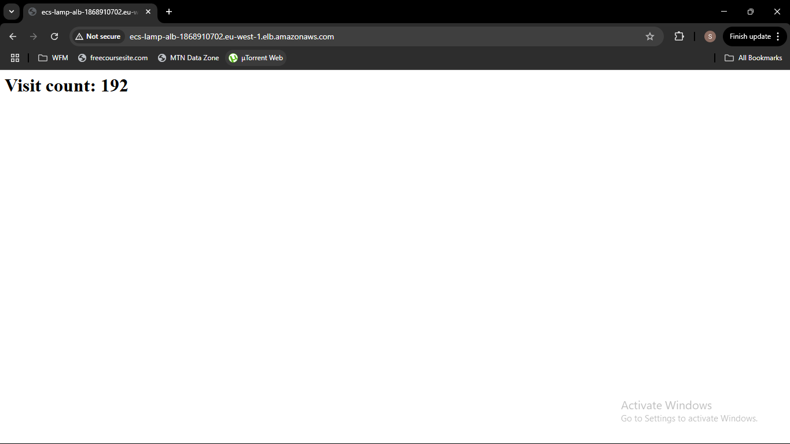

# ECS Fargate LAMP App Deployment (PHP + RDS + Secrets + Autoscaling)

This project deploys a containerized PHP application to **Amazon ECS Fargate** using the AWS CLI. It connects to an **RDS MySQL database**, uses **Secrets Manager** for secure credential management, and includes **autoscaling** based on CPU usage.

---

## 📦 Live Application

```
  http://ecs-lamp-alb-1868910702.eu-west-1.elb.amazonaws.com
```



## 📦 Application Overview

- Simple PHP app that stores and displays **visit count**
- Visit data is stored in a MySQL DB (Amazon RDS)
- Environment variables are securely injected from AWS Secrets Manager

---

## 🧱 Architecture

- **ECS Fargate** cluster with 2 tasks (multi-AZ)
- **ALB** (Application Load Balancer) in 2 public subnets
- **RDS MySQL** (multi-AZ enabled)
- **Secrets Manager** for DB credentials and endpoint
- **Autoscaling** enabled (target CPU = 80%)

---

## 🚀 Technologies Used

- PHP 8.1 (Apache)
- Docker (multi-stage build)
- Amazon ECS Fargate
- Amazon ECR
- Amazon RDS (MySQL)
- AWS Secrets Manager
- Application Load Balancer
- AWS CLI

---

## ⚙️ Deployment Steps

### 1. Build Docker Image

```
docker build -t ecs-lamp-app .
docker tag ecs-lamp-app:latest <your_ecr_uri>:latest
docker push <your_ecr_uri>:latest
```

### 2. Deploy ECS Infrastructure

Provisioned via AWS CLI:

- VPC, Subnets, IGW, NAT, Route Tables
- RDS MySQL with secret-managed credentials
- ECS Cluster and Task Definition with secret injection
- ALB + Target Group

### 3. Enable Autoscaling

```bash
aws application-autoscaling register-scalable-target   --service-namespace ecs   --resource-id service/ECS-LAMP-Cluster/ECS-LAMP-Service   --scalable-dimension ecs:service:DesiredCount   --min-capacity 2   --max-capacity 5

aws application-autoscaling put-scaling-policy   --service-namespace ecs   --resource-id service/ECS-LAMP-Cluster/ECS-LAMP-Service   --scalable-dimension ecs:service:DesiredCount   --policy-name ECS-CPU-AutoscalingPolicy   --policy-type TargetTrackingScaling   --target-tracking-scaling-policy-configuration '{
      "TargetValue": 80.0,
      "PredefinedMetricSpecification": {
          "PredefinedMetricType": "ECSServiceAverageCPUUtilization"
      },
      "ScaleInCooldown": 60,
      "ScaleOutCooldown": 60
  }'
```

---

## 🌍 Access App

Find the ALB DNS:

```bash
aws elbv2 describe-load-balancers   --names ECS-LAMP-ALB   --query "LoadBalancers[0].DNSName"   --output text
```

Visit in browser or:

```bash
curl http://<alb_dns_name>
```

---

## 📁 Project Structure

```
.
├── Dockerfile
├── src/
│   └── index.php
├── sql/
│   └── init.sql
├── infra-outputs.txt
├── ecs-task-def.json
├── ecs-trust.jsonS
└── pictures/ (screenshots of CLI setup)
```

---

## 👨‍💻 Author

Seth Anmawen
